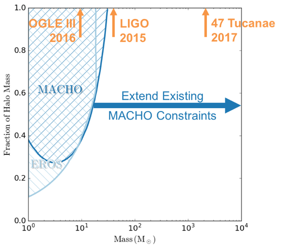

# Microlensing MACHO Dark Matter

## Summary

(The following is an excerpt from the ["Determining Whether Dark Matter is Entirely Primordial Black Holes with a Direct Detection DECam Microlensing Survey"](https://indico.fnal.gov/getFile.py/access?contribId=106&sessionId=5&resId=0&materialId=paper&confId=13702),
presented at the March 2017 DOE Cosmic Visions: New Ideas in Dark Matter workshop
by 
William A. Dawson1, Mark Ammons1, Tim Axelrod2, George Chapline1, 
Alex Drlica-Wagner3, Nathan Golovich4, and Michael Schneider1 
1 Lawrence Livermore National Laboratory, 2 University of Arizona, 
3 Fermi National Accelerator Laboratory, 4 University of California: Davis;
LLNL-CONF-727498)

With LIGO’s recent discovery of 30 solar mass (M_sol) black holes [1] and new
theoretical arguments [2], we are now motivated to consider a dark matter
candidate consisting entirely of primordial intermediate mass black holes formed
less than one second after the Big Bang (IM MACHOs; 15-10^4 M_sol). Previous
MACHO searches during the 1990’s constrained the MACHO content of the universe
for MACHO masses below 15 M_sol (Figure 1). Meanwhile, the original CMB [3] and
wide-binary [4] constraints from the 2000’s appeared to rule out black hole dark
matter above 2 M_sol; however, these constraints were reliant on complex and
poorly constrained astrophysical assumptions. As these assumptions were explored
in more detail [5,6], the window reopened between 30 < M_darkmatter ~< 200 M_sol
but still with “order-of-magnitude” uncertainty due to necessary assumptions.
The latest astrophysical constraint based on the stellar profile in dwarf
galaxies [7], that presumably rules out black hole dark matter >20 M_sol, is
also reliant on several astrophysical assumptions (a delta function MACHO mass
function, no central massive black hole, and that the Eridanus II star cluster
is at the center of the dwarf galaxy) which may be incorrect [8,9,10], and would
cause the mass window to reopen.

Rather than attempt to address the various complex assumptions and associated
systematics with these astrophysical probes, we propose to carry-out direct
detection microlensing measurements of the intermediate mass MACHO population to
determine if they comprise all of the dark matter.

Previous microlensing surveys were limited by image quality, analysis methods,
and computational resources. Modern telescopes, instruments, and computing
enable our parallactic microlensing detection method, which is ideal for the
multi-year microlensing event timescales of intermediate mass MACHOs [1]. This
is supported by a recent detection of a 9.6 M_sol black hole [11]. By combining
the parallactic [12] and astrometric [13] microlensing signals we can break the
lensing mass-geometry degeneracy and make a precise measurement of individual
black hole masses. Thus, if primordial black holes make up dark matter, we will
be measuring their “particle” properties, and the distribution of their masses
will provide insight into the fundamental physics of the early universe.
Furthermore, the parallactic microlensing signal enables dark matter mass
constraints irrespective of the Einstein radius crossing time (i.e. mass), thus
we can constrain all mass ranges >10 M_sol.

LSST has potential to be the ideal survey for this science (with ~1000 expected
microlensing events); however, microlensing is currently outside its current
observing protocol. Additionally, current survey plan options, which only
observe the Milky Way in the first year, will unnecessarily preclude
microlensing dark matter science. It is pressing that we begin this effort now
while there is still time to influence the LSST survey strategy.

Figure 1: Existing constraints on the fraction of the mass in the MW halo that
can be composed of IM MACHO dark matter. We seek to extend the existing MACHO
microlensing constraint to higher masses. The masses of detected black holes are
indicated in orange [1,9,11].

### References
1. Abbott, B P, R Abbott, T D Abbott, M R Abernathy, F Acernese, K Ackley, C Adams, et al. 2016. “Observation of Gravitational Waves From a Binary Black Hole Merger.” Physical Review Letters, 116, 6
2. Chapline, George F, and Paul H Frampton. 2016. “ A New Direction for Dark Matter Research: Intermediate-Mass Compact Halo Objects.” Journal of Cosmology and Astroparticle Physics 2016, 11, 042–042
3. Ricotti, Massimo, Jeremiah P Ostriker, and Katherine J Mack. 2008. “Effect of Primordial Black Holes on the Cosmic Microwave Background and Cosmological Parameter Estimates.” The Astrophysical Journal, 680, 829–45
4. Yoo, Jaiyul, Julio Chanamé, and Andrew Gould. 2004. “The End of the MACHO Era: Limits on Halo Dark Matter From Stellar Halo Wide Binaries.” The Astrophysical Journal 601, 311–18
5. Quinn, D P, M I Wilkinson, M J Irwin, J Marshall, A Koch, and V Belokurov. 2009. “On the Reported Death of the MACHO Era.” Monthly Notices of the Royal Astronomical Society: Letters 396, L11–L15
6. Ali-Haïmoud, Yacine, and Marc Kamionkowski. 2016. “Cosmic Microwave Background Limits on Accreting Primordial Black Holes.” arXiv:1612.05644v2
7. Brandt, Timothy D. 2016. “Constraints on MACHO Dark Matter From Compact Stellar Systems in Ultra-Faint Dwarf Galaxies.” The Astrophysical Journal Letters 824, L31
8. Li, T S, J D Simon, A Drlica-Wagner, K Bechtol, M Y Wang, J García-Bellido, J Frieman, et al. 2016. “Farthest Neighbor: the Distant Milky Way Satellite Eridanus II.” arXiv:1611.05052v2
9. Kızıltan, Bülent, Holger Baumgardt, and Abraham Loeb. 2017. “An Intermediate-Mass Black Hole in the Centre of the Globular Cluster 47 Tucanae.” Nature 542, 203–5
10. Crnojević, D, D J Sand, D Zaritsky, K Spekkens, B. Willman, and J R Hargis. 2016. “Deep Imaging of Eridanus II and Its Lone Star Cluster.” The Astrophysical Journal Letters 824, L14
11. Wyrzykowski, L, Z Kostrzewa-Rutkowska, J Skowron, K A Rybicki, P Mróz, S Kozlowski, A Udalski, et al. 2016. “Black Hole, Neutron Star and White Dwarf Candidates From Microlensing with OGLE-III.” MNRAS 458, 3012–26
12. Alcock, C, R A Allsman, D Alves, T S Axelrod, D P Bennett, K. H. Cook, K C Freeman, et al. 1995. “First Observation of Parallax in a Gravitational Microlensing Event.” Astrophysical Journal Letters 454, L125
13. Lu, J R, E Sinukoff, E O Ofek, A Udalski, and S Kozlowski. 2016. “A Search for Stellar-Mass Black Holes via Astrometric Microlensing.” Astrophysical Journal 830, 41
14. Yee, Jennifer C. 2015. “Lens Masses and Distances From Microlens Parallax and Flux.” The Astrophysical Journal Letters 814, L11

This work was performed under the auspices of the U.S. Department of Energy by Lawrence Livermore National Laboratory under Contract DE-AC52-07NA27344.
